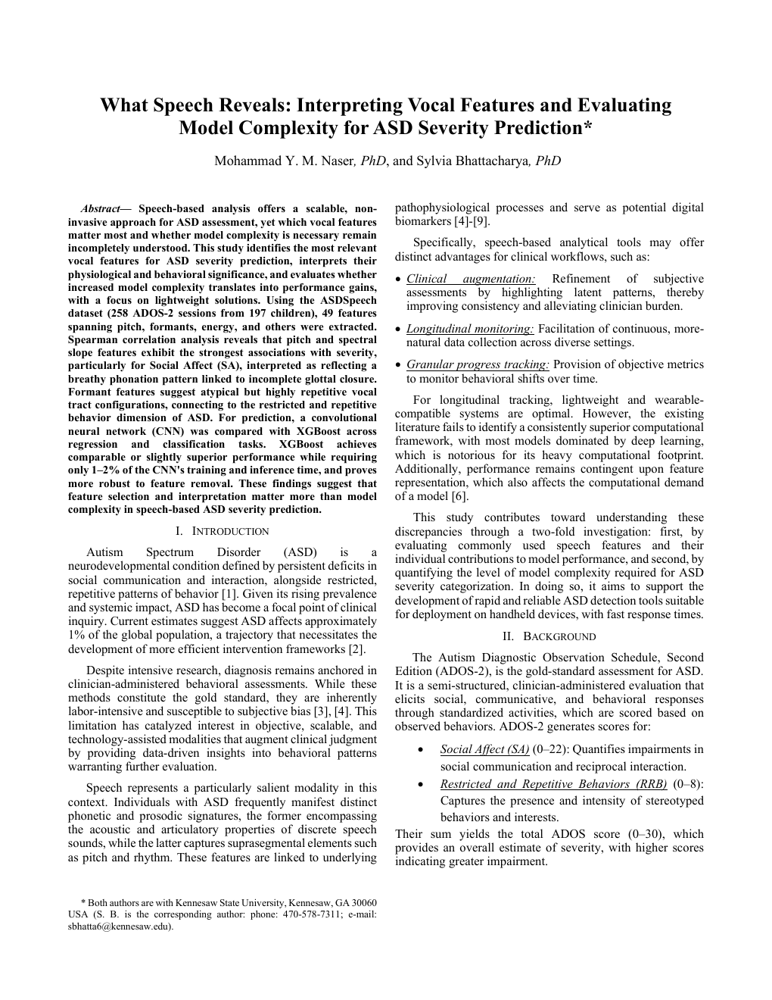

# What Speech Reveals

## Interpreting Vocal Features and Evaluating Model Complexity for ASD Severity Prediction

### [📄 Open the full manuscript (PDF)](paper.pdf)

*Click the preview to open the complete paper.*

---

This repository contains the manuscript for an unpublished research study examining which speech-derived features are most informative for estimating autism symptom severity and whether increased model complexity improves predictive performance.

> **Status:** Unpublished manuscript. This work has not undergone formal peer review.

## Overview

Speech-based analysis may provide non-invasive tools that augment longitudinal clinical assessment. This study investigates two related questions:

1. Which acoustic and conversational speech features are most strongly associated with Autism Diagnostic Observation Schedule, Second Edition (ADOS-2) severity measures?
2. Does a convolutional neural network (CNN) provide a meaningful advantage over a lighter-weight XGBoost model?

The analysis uses speech-derived features from the ASDSpeech dataset, comprising 258 ADOS-2 assessment sessions from 197 children. The feature set includes measures related to pitch, formants, jitter, voicing, energy, zero-crossing rate, spectral slope, and vocalization duration.

## Main findings

- Pitch and spectral-slope features showed the strongest associations with Social Affect scores.
- Formant-related features exhibited relationships with Restricted and Repetitive Behavior scores.
- XGBoost achieved performance comparable to or slightly better than the CNN while requiring approximately 1–2% of its training and inference time.
- The results suggest that careful feature selection and interpretation may matter more than model complexity for this task.

These findings are exploratory and should not be interpreted as establishing a diagnostic system or clinical biomarker.

## Manuscript

[Read the full manuscript](paper.pdf)

Suggested citation:

> Naser, M. Y. M., & Bhattacharya, S. *What Speech Reveals: Interpreting Vocal Features and Evaluating Model Complexity for ASD Severity Prediction*. Unpublished manuscript.

## Data availability

The participant-level data used in the study are **not included in this repository**. The analysis uses data derived from clinical assessment recordings and is subject to the permissions and restrictions governing the original ASDSpeech dataset.

The underlying ASDSpeech work is described in:

> Naderi, H. R., et al. (2025). Reliably quantifying the severity of social symptoms in children with autism using ASDSpeech. *Translational Psychiatry, 15*, 115. https://doi.org/10.1038/s41398-025-03233-6

## Authors

- Mohammad Y. M. Naser, PhD — Kennesaw State University
- Sylvia Bhattacharya, PhD — Kennesaw State University

## Responsible-use notice

This research is intended for scientific investigation. It is not a medical device, diagnostic instrument, or substitute for evaluation by qualified clinicians. The manuscript should not be used to make clinical decisions about individuals.

## License and reuse

Copyright is retained by the authors. No permission to reproduce, modify, or redistribute the manuscript is granted unless separately authorized by all relevant rights holders.
